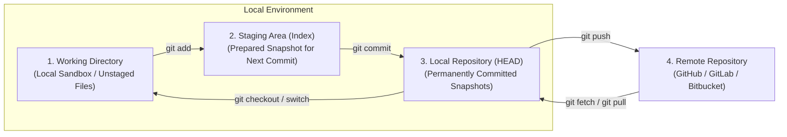

# Assignment 1: Git Repository and Branch Management

**Course / Module:** Version Control & DevOps Foundations  
**Topic:** Git Repository Architecture, Branching, Merging, and History Management  
**Demo Repository Location:** `C:\Users\prati\.gemini\antigravity\scratch\git-assignment-1`  

---

## 1. Introduction

**Git** is a free, open-source **Distributed Version Control System (DVCS)** designed to track changes in source code across the software development lifecycle. Unlike centralized systems (e.g., SVN), every Git clone is a full-fledged repository with complete history and revision-tracking capabilities, independent of network access or a central server.

### The Git 3-Tree Architecture

Git manages code across three primary internal state trees (plus the remote repository):



1. **Working Directory:** The actual files on your local filesystem that you are currently editing, adding, or deleting.
2. **Staging Area (Index):** A binary file (typically located at `.git/index`) that collects changes designated to be included in the next commit. It acts as a draft or staging ground.
3. **Local Repository (HEAD):** The internal object database stored within the `.git` directory containing committed snapshots (commits, trees, and blobs) and branch pointers.
4. **Remote Repository:** A centralized repository hosted on a cloud or remote server (such as GitHub) enabling collaborative development, backup, and CI/CD integration.

---

## 2. Common Git Commands Reference

| Command | Category | Description |
| :--- | :--- | :--- |
| `git init` | Setup | Initializes a new local Git repository inside the current directory. |
| `git status` | Inspection | Displays the current branch and tracks staged, unstaged, and untracked files. |
| `git add <file>` | Staging | Stages file modifications for the next commit snapshot. |
| `git commit -m "<msg>"` | History | Persists the staged snapshot to the local repository with an informative message. |
| `git log` | Inspection | Lists chronological commit history, hashes, authors, dates, and messages. |
| `git branch` | Branching | Lists existing branches, creates new branches, or deletes branches. |
| `git switch` / `git checkout` | Navigation | Switches the active working branch (`git switch <branch>`). |
| `git merge <branch>` | Integration | Joins the specified branch's commit history into the current checked-out branch. |
| `git pull` | Remote | Fetches updates from a remote repository and integrates them into the current branch. |
| `git push` | Remote | Uploads local branch commits to the corresponding branch on a remote server. |
| `git reset` | History Modification | Moves the current branch head backwards to an earlier commit (rewriting local history). |
| `git revert` | Safe Undo | Creates a brand-new commit that records the inverse of a target past commit. |
| `git rebase` | History Modification | Re-applies commits from one branch onto the tip of another branch to maintain linear history. |

---

## 3. Step-by-Step Practical Task Execution

The following operations were executed in the project directory `git-assignment-1`.

### Task 1: Initialize the Git Repository
Initialize a new local repository with `main` as the default branch name and verify configuration.

```powershell
mkdir C:\Users\prati\.gemini\antigravity\scratch\git-assignment-1
cd C:\Users\prati\.gemini\antigravity\scratch\git-assignment-1
git init -b main
git config user.name "Dev Student"
git config user.email "student@example.com"
```

**Terminal Output:**
```text
Initialized empty Git repository in C:/Users/prati/.gemini/antigravity/scratch/git-assignment-1/.git/
```

---

### Task 2: Create Project Files and Initial Commit
Create the base project files (`calculator.py` and `README.md`), stage them, and record the initial commit.

**File: `calculator.py`**
```python
def add(a, b):
    return a + b

def subtract(a, b):
    return a - b

if __name__ == '__main__':
    print('Calculator initialized.')
```

**Commands:**
```powershell
git status
git add README.md calculator.py
git commit -m "feat: initial commit with basic calculator and readme"
```

**Terminal Output:**
```text
On branch main
No commits yet

Untracked files:
  (use "git add <file>..." to include in what will be committed)
	README.md
	calculator.py

[main (root-commit) 0af4fa8] feat: initial commit with basic calculator and readme
 2 files changed, 11 insertions(+)
 create mode 100644 README.md
 create mode 100644 calculator.py
```

---

### Task 3: Create a Feature Branch
Create and switch to an isolated feature branch named `feature-calculator`.

```powershell
git switch -c feature-calculator
git branch
```

**Terminal Output:**
```text
Switched to a new branch 'feature-calculator'
* feature-calculator
  main
```
*(The asterisk `*` indicates that HEAD is currently pointing to `feature-calculator`.)*

---

### Task 4: Modify Project on Feature Branch & Commit
Extend `calculator.py` with multiplication and division methods, then commit on the feature branch.

**Commands:**
```powershell
# (Updated calculator.py with multiply and divide functions)
git add calculator.py
git commit -m "feat(calculator): add multiply and divide functions"
```

**Terminal Output:**
```text
[feature-calculator 85337c8] feat(calculator): add multiply and divide functions
 1 file changed, 9 insertions(+), 1 deletion(-)
```

---

### Task 5: Switch Back to Main & Make an Independent Change
Switch back to `main` and update `README.md` to add project documentation guidelines, simulating concurrent development.

```powershell
git switch main
# (Updated README.md with project guidelines)
git add README.md
git commit -m "docs: update project guidelines in README"
```

**Terminal Output:**
```text
Switched to branch 'main'
[main 6cbf151] docs: update project guidelines in README
 1 file changed, 4 insertions(+)
```

---

### Task 6: Merge the Feature Branch into Main
Combine `feature-calculator` into `main`. Because both branches had diverged with non-overlapping commits, Git performs a **3-way merge** using the `ort` strategy and generates a merge commit.

```powershell
git merge feature-calculator -m "Merge feature-calculator into main"
```

**Terminal Output:**
```text
Merge made by the 'ort' strategy.
 calculator.py | 10 +++++++++-
 1 file changed, 9 insertions(+), 1 deletion(-)
```

---

### Task 7: Push the Changes to GitHub
To publish the local repository to GitHub:

1. Create a repository on GitHub (e.g., named `git-assignment-1`).
2. Add the remote target and push the `main` branch with upstream tracking.

```powershell
# Link remote repository
git remote add origin https://github.com/<your-username>/git-assignment-1.git

# Set default branch name to main (if not already set)
git branch -M main

# Push branch and set upstream tracking
git push -u origin main
```

> [!NOTE]
> When pushing for the first time, Git prompts for credentials. You can authenticate using a GitHub Personal Access Token (PAT) with `repo` scope, SSH keys (`git@github.com:...`), or via GitHub CLI (`gh auth login`).

---

### Task 8: Examine History with `git log` and `git show`

#### 8.1 Repository History Graph (`git log --graph --oneline --all`)
```powershell
git log --graph --oneline --all
```

**Terminal Output:**
```text
*   1ff3907 Merge feature-calculator into main
|\  
| * 85337c8 feat(calculator): add multiply and divide functions
* | 6cbf151 docs: update project guidelines in README
|/  
* 0af4fa8 feat: initial commit with basic calculator and readme
```

#### 8.2 Inspecting the Latest Commit (`git show HEAD`)
```powershell
git show HEAD --stat
```

**Terminal Output:**
```text
commit 1ff39073aa1ad43a2a062e1fb7b626224001a155
Merge: 6cbf151 85337c8
Author: Dev Student <student@example.com>
Date:   Tue Sep 8 17:34:29 2026 +0530

    Merge feature-calculator into main

 calculator.py | 10 +++++++++-
 1 file changed, 9 insertions(+), 1 deletion(-)
```

---

### Task 9: Practical Demonstration — `git reset` vs `git revert`

Understanding the fundamental difference between `git reset` and `git revert` is critical in software engineering.

```
       GIT RESET (History Rewriting)               GIT REVERT (Forward-Moving Safe Undo)
       
  Before:  C1 --- C2 --- C3 (HEAD)           Before:  C1 --- C2 --- C3 (HEAD)
  
  Action:  git reset --mixed HEAD~1          Action:  git revert C3
  
  After:   C1 --- C2 (HEAD)                  After:   C1 --- C2 --- C3 --- C4 (HEAD, inverts C3)
           (C3 is unlinked from history)              (History is strictly preserved!)
```

#### 9.1 Demonstration of `git reset`
Create an experimental commit and then undo it using `git reset`.

```powershell
# Create an experimental file and commit it
git add experimental.py
git commit -m "feat: experimental feature testing"
```
*Commit log before reset:*
```text
ba31739 feat: experimental feature testing
1ff3907 Merge feature-calculator into main
6cbf151 docs: update project guidelines in README
```

*Executing reset:*
```powershell
git reset --mixed HEAD~1
```
*Commit log after reset:*
```text
1ff3907 Merge feature-calculator into main
6cbf151 docs: update project guidelines in README
85337c8 feat(calculator): add multiply and divide functions
```
*Working tree status:*
```text
?? experimental.py
```
**Observation:** The commit `ba31739` was completely removed from the branch log. The branch pointer moved back by 1 commit. The changes were kept in the working directory as untracked files because `--mixed` was used.

---

#### 9.2 Demonstration of `git revert`
Introduce a buggy commit and undo it using `git revert`.

```powershell
# Create buggy code and commit it
git add discount.py
git commit -m "feat: add buggy discount function"
```
*Commit log before revert:*
```text
fafe4be feat: add buggy discount function
1ff3907 Merge feature-calculator into main
6cbf151 docs: update project guidelines in README
```

*Executing revert:*
```powershell
git revert HEAD --no-edit
```
*Commit log after revert:*
```text
baafbb5 Revert "feat: add buggy discount function"
fafe4be feat: add buggy discount function
1ff3907 Merge feature-calculator into main
6cbf151 docs: update project guidelines in README
```

**Observation:** Notice that commit `fafe4be` **remains in the Git history**. A new commit (`baafbb5`) was created on top of it that explicitly reversed the changes (deleting `discount.py`).

---

#### 9.3 Comparison: `git reset` vs `git revert`

| Dimension | `git reset` | `git revert` |
| :--- | :--- | :--- |
| **History Effect** | **Rewrites History**: Moves the branch pointer backward. The targeted commits are detached/discarded. | **Preserves History**: Appends a new commit that applies the opposite changes. |
| **Working Tree Options** | `--soft` (keeps staged), `--mixed` (default, keeps unstaged), `--hard` (wipes out changes). | Applies directly to staging/working tree and commits the inverse change. |
| **Safety on Shared / Remote Branches** | **Dangerous**: If pushed previously, requires `git push --force`, which breaks collaborators' local clones. | **Completely Safe**: Since history is append-only, collaborators can pull normally without conflict. |
| **Best Used When** | Fixing mistakes on private, local branches before pushing to GitHub. | Undoing unintended or faulty changes on public, shared, or production branches. |

---

## 4. Best Practices Summary

1. **Write Meaningful Commit Messages:** Use conventions like [Conventional Commits](https://www.conventionalcommits.org/) (e.g., `feat:`, `fix:`, `docs:`, `refactor:`, `test:`) with clear imperative summaries.
2. **Branch Isolation:** Keep the `main` branch production-ready at all times. Develop features and fixes in short-lived feature branches (`feature/xyz`, `bugfix/abc`).
3. **Pull Before Starting New Work:** Frequently sync with `git pull --rebase` to minimize merge conflicts.
4. **Use `.gitignore`:** Exclude virtual environments (`venv/`), dependencies (`node_modules/`), compiled binaries (`__pycache__/`, `.exe`), and secrets/tokens (`.env`).
5. **Protect Shared History:** Never use destructive commands (`git reset --hard`, `git push --force`) on branches shared with team members; use `git revert` instead.

---

## 5. Conclusion

Git's 3-tree architecture provides unmatched flexibility, performance, and data integrity for tracking software evolution. Through isolated branching and deterministic merging strategies, teams can work concurrently on diverse features without stepping on each other's work. Mastery over foundational commands—especially knowing when to use `git revert` over `git reset`—forms the backbone of robust software engineering and continuous integration / continuous deployment (CI/CD) pipelines.
