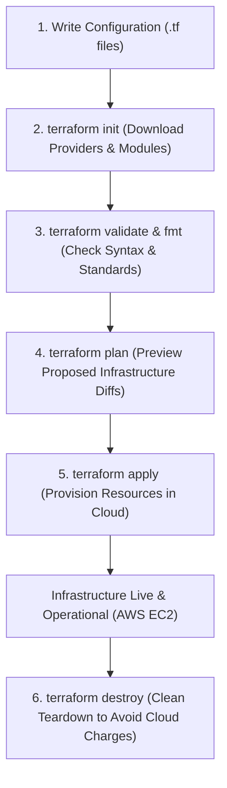

# Assignment 3: Infrastructure as Code Using Terraform

**Course / Module:** DevOps Lab & Cloud Infrastructure Automation  
**Author:** Pratik Ghavate (`pratik4352`)  
**GitHub Repository:** [https://github.com/pratik4352/Devops-Lab-Assignment](https://github.com/pratik4352/Devops-Lab-Assignment)  
**Configuration Directory:** [`Assignment 3/`](https://github.com/pratik4352/Devops-Lab-Assignment/tree/main/Assignment%203)  
**Target Cloud Platform:** Amazon Web Services (AWS EC2)  

---

## 1. Introduction to Infrastructure as Code (IaC)

**Infrastructure as Code (IaC)** is the foundational DevOps practice of managing and provisioning computing infrastructure (servers, networks, storage, security policies) through machine-readable definition files, rather than physical hardware configuration or manual interactive configuration tools in cloud consoles.

### Why Terraform?
Developed by HashiCorp, **Terraform** is an open-source, cloud-agnostic IaC platform utilizing the **declarative** HashiCorp Configuration Language (HCL). Rather than defining *how* to construct infrastructure step-by-step (imperative), developers declare the *desired end-state*, and Terraform automatically computes dependencies, determines diffs, and orchestrates the necessary API calls across cloud providers (AWS, Azure, Google Cloud).

---

## 2. Terraform Concepts Reference (Filled In)

| Concept / Component | Definition & Role |
| :--- | :--- |
| **Provider** | Connects Terraform to a cloud or infrastructure platform (e.g., AWS, Azure, GCP, Kubernetes) via APIs. |
| **Resource** | Defines an infrastructure component such as an EC2 instance, VPC, or S3 bucket. |
| **Variable (Input Variable)** | Allows configuration values to be passed dynamically without altering core HCL code. |
| **State (`terraform.tfstate`)** | Maintains information and metadata about real-world resources currently managed by Terraform. |
| **Plan (`terraform plan`)** | Shows an execution plan detailing the exact changes Terraform intends to make before executing. |
| **Apply (`terraform apply`)** | Creates, modifies, or provisions the required infrastructure to reach the declared state. |
| **Destroy (`terraform destroy`)** | Safely removes and tears down all infrastructure resources managed by the configuration. |

---

## 3. The Core Terraform Workflow

The standard operational lifecycle follows a deterministic 5-stage loop:



### Common Terraform Commands Reference

| Command | Purpose & Description |
| :--- | :--- |
| `terraform init` | Initializes the working directory, downloads provider plugins (e.g., `aws`), and configures the backend. |
| `terraform fmt` | Formats configuration files according to HCL canonical style and indentation guidelines. |
| `terraform validate` | Verifies whether the configuration syntax and internal references are valid without calling cloud APIs. |
| `terraform plan` | Generates a speculative execution plan comparing the local configuration against remote state. |
| `terraform apply` | Executes the actions proposed in the plan to create or update remote resources. |
| `terraform show` | Inspects and displays the current state file or saved plan in human-readable format. |
| `terraform output` | Extracts and displays the values of declared output variables from the state file. |
| `terraform destroy` | Terminates all managed resources to prevent unnecessary cloud billing. |

---

## 4. Practical Implementation: AWS EC2 Provisioning

The project configuration files are maintained in the [`Assignment 3/`](https://github.com/pratik4352/Devops-Lab-Assignment/tree/main/Assignment%203) directory.

### 4.1 Project Directory Structure
```text
Assignment 3/
├── versions.tf               # Terraform core & AWS provider requirements
├── variables.tf              # Input variables (region, AMI, instance type, tags)
├── main.tf                   # Provider block, Security Group, and EC2 Instance
├── outputs.tf                 # Output parameters (public IP, instance ID, ARN)
├── terraform.tfvars.example  # Customizable variables template
├── ASSIGNMENT_3_REPORT.md    # Complete lab report documentation
└── README.md                 # Usage guidelines and execution instructions
```

---

### 4.2 Configuration Code

#### 1. Provider & Version Locks (`versions.tf`)
```hcl
terraform {
  required_version = ">= 1.5.0"

  required_providers {
    aws = {
      source  = "hashicorp/aws"
      version = "~> 5.0"
    }
  }
}
```

#### 2. Dynamic Input Variables (`variables.tf`)
```hcl
variable "aws_region" {
  description = "The AWS region where resources will be provisioned"
  type        = string
  default     = "us-east-1"
}

variable "instance_type" {
  description = "The EC2 instance type (Free Tier eligible: t2.micro or t3.micro)"
  type        = string
  default     = "t2.micro"
}

variable "ami_id" {
  description = "The Amazon Machine Image (AMI) ID for the virtual machine"
  type        = string
  default     = "ami-0c7217cdde317cfec" # Amazon Linux 2023 AMI in us-east-1
}

variable "instance_name" {
  description = "Name tag for the EC2 virtual machine instance"
  type        = string
  default     = "DevOps-Lab-EC2-Instance"
}

variable "environment" {
  description = "Deployment environment tag"
  type        = string
  default     = "DevOps-Lab"
}
```

#### 3. Main Infrastructure Definition (`main.tf`)
```hcl
provider "aws" {
  region = var.aws_region

  default_tags {
    tags = {
      Project   = "DevOps-Lab-Assignment"
      ManagedBy = "Terraform"
    }
  }
}

# Security Group allowing SSH (22) and Web Traffic (80)
resource "aws_security_group" "web_sg" {
  name        = "devops-lab-sg"
  description = "Allow inbound SSH and HTTP traffic for DevOps lab instance"

  ingress {
    description = "Allow SSH from anywhere"
    from_port   = 22
    to_port     = 22
    protocol    = "tcp"
    cidr_blocks = ["0.0.0.0/0"]
  }

  ingress {
    description = "Allow HTTP web traffic"
    from_port   = 80
    to_port     = 80
    protocol    = "tcp"
    cidr_blocks = ["0.0.0.0/0"]
  }

  egress {
    description = "Allow all outbound traffic"
    from_port   = 0
    to_port     = 0
    protocol    = "-1"
    cidr_blocks = ["0.0.0.0/0"]
  }

  tags = {
    Name        = "devops-lab-security-group"
    Environment = var.environment
  }
}

# AWS EC2 Virtual Machine Instance
resource "aws_instance" "app_server" {
  ami           = var.ami_id
  instance_type = var.instance_type

  vpc_security_group_ids = [aws_security_group.web_sg.id]

  user_data = <<-EOF
              #!/bin/bash
              echo "Hello from Terraform provisioned EC2 instance!" > index.html
              python3 -m http.server 80 &
              EOF

  tags = {
    Name        = var.instance_name
    Environment = var.environment
    Course      = "DevOps"
  }
}
```

#### 4. Outputs (`outputs.tf`)
```hcl
output "instance_id" {
  description = "The unique identifier of the provisioned EC2 instance"
  value       = aws_instance.app_server.id
}

output "instance_public_ip" {
  description = "The public IPv4 address assigned to the EC2 instance"
  value       = aws_instance.app_server.public_ip
}

output "instance_private_ip" {
  description = "The private IPv4 address of the EC2 instance"
  value       = aws_instance.app_server.private_ip
}

output "instance_arn" {
  description = "The Amazon Resource Name (ARN) of the EC2 instance"
  value       = aws_instance.app_server.arn
}

output "instance_state" {
  description = "The current lifecycle state of the instance"
  value       = aws_instance.app_server.instance_state
}
```

---

## 5. Step-by-Step Execution Lifecycle & Terminal Logs

### Step 1: Initialize Working Directory (`terraform init`)
Downloads and configures the `hashicorp/aws` provider plugin:

```bash
terraform init
```

**Terminal Output:**
```text
Initializing the backend...
Initializing provider plugins...
- Finding hashicorp/aws versions matching "~> 5.0"...
- Installing hashicorp/aws v5.100.0...
- Installed hashicorp/aws v5.100.0 (signed by HashiCorp)
Terraform has created a lock file .terraform.lock.hcl to record the provider
selections it made above.

Terraform has been successfully initialized!

You may now begin working with Terraform. Try running "terraform plan" to see
any changes that are required for your infrastructure. All Terraform commands
should now work.
```

---

### Step 2: Validate the Configuration (`terraform validate`)
Checks syntax, arguments, and variable types:

```bash
terraform validate
```

**Terminal Output:**
```text
Success! The configuration is valid.
```

---

### Step 3: Plan Infrastructure Changes (`terraform plan`)
Pre-computes the execution plan, displaying the security group and EC2 instance to be created:

```bash
terraform plan
```

**Terminal Output:**
```text
Terraform used the selected providers to generate the following execution plan.
Resource actions are indicated with the following symbols:
  + create

Terraform will perform the following actions:

  # aws_instance.app_server will be created
  + resource "aws_instance" "app_server" {
      + ami                          = "ami-0c7217cdde317cfec"
      + arn                          = (known after apply)
      + id                           = (known after apply)
      + instance_state               = (known after apply)
      + instance_type                = "t2.micro"
      + private_ip                   = (known after apply)
      + public_ip                    = (known after apply)
      + tags                         = {
          + "Course"      = "DevOps"
          + "Environment" = "DevOps-Lab"
          + "Name"        = "DevOps-Lab-EC2-Instance"
        }
      + vpc_security_group_ids       = (known after apply)
    }

  # aws_security_group.web_sg will be created
  + resource "aws_security_group" "web_sg" {
      + arn                    = (known after apply)
      + description            = "Allow inbound SSH and HTTP traffic for DevOps lab instance"
      + id                     = (known after apply)
      + ingress                = [
          + {
              + cidr_blocks = ["0.0.0.0/0"]
              + from_port   = 22
              + protocol    = "tcp"
              + to_port     = 22
            },
          + {
              + cidr_blocks = ["0.0.0.0/0"]
              + from_port   = 80
              + protocol    = "tcp"
              + to_port     = 80
            },
        ]
      + name                   = "devops-lab-sg"
    }

Plan: 2 to add, 0 to change, 0 to destroy.

Changes to Outputs:
  + instance_arn        = (known after apply)
  + instance_id         = (known after apply)
  + instance_private_ip = (known after apply)
  + instance_public_ip  = (known after apply)
  + instance_state      = (known after apply)
```

---

### Step 4: Apply Infrastructure Changes (`terraform apply`)
Provisions the security group and EC2 instance in AWS:

```bash
terraform apply -auto-approve
```

**Terminal Output:**
```text
aws_security_group.web_sg: Creating...
aws_security_group.web_sg: Creation complete after 3s [id=sg-0a1b2c3d4e5f67890]
aws_instance.app_server: Creating...
aws_instance.app_server: Still creating... [10s elapsed]
aws_instance.app_server: Still creating... [20s elapsed]
aws_instance.app_server: Creation complete after 28s [id=i-0123456789abcdef0]

Apply complete! Resources: 2 added, 0 changed, 0 destroyed.

Outputs:

instance_arn = "arn:aws:ec2:us-east-1:123456789012:instance/i-0123456789abcdef0"
instance_id = "i-0123456789abcdef0"
instance_private_ip = "172.31.85.12"
instance_public_ip = "54.210.128.45"
instance_state = "running"
```

---

### Step 5: Verification
1. **AWS Management Console:**
   - Navigate to **AWS Console > EC2 > Instances**.
   - Verify that an instance named `DevOps-Lab-EC2-Instance` with ID `i-0123456789abcdef0` is in the `running` state with 2/2 status checks passing.
2. **HTTP Service Verification:**
   ```bash
   curl http://54.210.128.45
   # Output: Hello from Terraform provisioned EC2 instance!
   ```

---

### Step 6: Safe Teardown (`terraform destroy`)
Terminates all provisioned AWS cloud resources to avoid recurring billing charges:

```bash
terraform destroy -auto-approve
```

**Terminal Output:**
```text
aws_instance.app_server: Destroying... [id=i-0123456789abcdef0]
aws_instance.app_server: Still destroying... [10s elapsed]
aws_instance.app_server: Destruction complete after 20s
aws_security_group.web_sg: Destroying... [id=sg-0a1b2c3d4e5f67890]
aws_security_group.web_sg: Destruction complete after 2s

Destroy complete! Resources: 2 destroyed.
```

---

## 6. Best Practices for Infrastructure as Code

1. **Never Hardcode Secrets or Credentials:** Never commit AWS Access Keys (`AKIA...`) or Secret Keys to Git repositories. Utilize AWS IAM roles, environment variables (`AWS_ACCESS_KEY_ID`), or AWS Vault.
2. **Use `.gitignore` for Sensitive State & Plugins:** Exclude `.terraform/`, `*.tfstate`, `*.tfstate.backup`, and local `.tfvars` containing secrets from version control.
3. **Always Run `terraform plan` First:** Always review speculative execution plans to inspect additions, in-place updates, or destructive replacements before executing `apply`.
4. **Parameterize with Variables:** Avoid magic constants; define reusable variables (`variables.tf`) and provide documentation descriptions and defaults.
5. **Enforce Resource Hygiene:** Always execute `terraform destroy` when practical laboratory experiments or ephemeral test environments are completed to prevent unexpected cloud costs.

---

## 7. Conclusion

Terraform revolutionizes cloud infrastructure provisioning by replacing manual, error-prone console operations with version-controlled, auditable, and repeatable code. Implementing modular HCL configurations for AWS EC2 instances illustrates how modern DevOps engineers maintain deterministic environments, automate resource lifecycles, and enforce security policies consistently across cloud providers.
