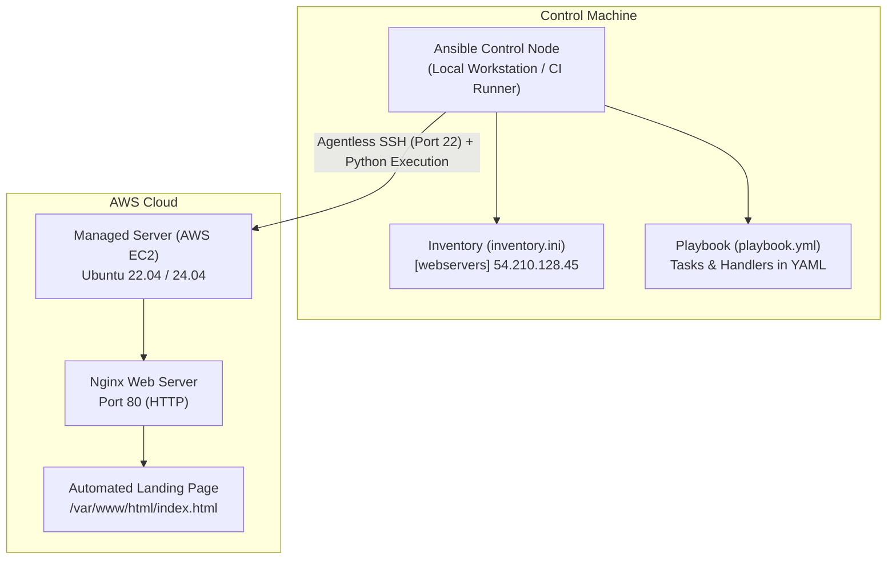

# Assignment 5: Cloud Infrastructure and Server Automation Using AWS and Ansible

**Course / Module:** DevOps Lab & Cloud Automation  
**Author:** Pratik Ghavate (`pratik4352`)  
**GitHub Repository:** [https://github.com/pratik4352/Devops-Lab-Assignment](https://github.com/pratik4352/Devops-Lab-Assignment)  
**Configuration Directory:** [`Assignment 5/`](https://github.com/pratik4352/Devops-Lab-Assignment/tree/main/Assignment%205)  
**Target Infrastructure:** Amazon Web Services (AWS EC2) & Ansible  

---

## 1. Introduction

Modern cloud platforms provide scalable, on-demand compute, storage, and networking resources that can be provisioned dynamically. However, manually logging into virtual servers to install packages, configure services, and deploy applications is slow, error-prone, and unsustainable at scale.

**Ansible** is an open-source automation engine and configuration management tool that automates software provisioning, configuration management, and application deployment. Ansible uses an **agentless** architecture: it connects to managed remote servers securely over standard **SSH** (or WinRM for Windows), executes tasks via Python modules, and automatically removes temporary execution artifacts.

---

## 2. AWS Services Reference (Filled In)

| AWS Service | Definition & Category | Primary Function |
| :--- | :--- | :--- |
| **Amazon EC2 (Elastic Compute Cloud)** | Compute | Provides resizable, secure virtual servers (instances) in the cloud. |
| **Amazon S3 (Simple Storage Service)** | Storage | Provides highly durable, scalable object storage for backups, media, and static assets. |
| **Amazon RDS (Relational Database Service)** | Database | Provides managed relational database engines (PostgreSQL, MySQL, MariaDB, Oracle, SQL Server). |
| **Amazon Aurora** | Database | High-performance, AWS-managed relational database engine compatible with MySQL and PostgreSQL (up to 5x throughput). |
| **Elastic Load Balancing (ELB)** | Networking | Automatically distributes incoming application traffic across multiple targets (EC2 instances, containers, IP addresses). |
| **Amazon ECS (Elastic Container Service)** | Containers | Fully managed container orchestration service that facilitates running and scaling Docker containers. |

---

## 3. Ansible Architecture & Components (Filled In)



| Ansible Component | Definition & Role |
| :--- | :--- |
| **Control Node** | The machine (developer workstation, bastion host, or CI/CD runner) from which Ansible commands and playbooks are executed. |
| **Managed Node** | The target server, cloud instance (AWS EC2), or network appliance configured and managed by Ansible. |
| **Inventory** | A text file (INI or YAML) defining the hostnames, IP addresses, groups, and connection variables of the managed nodes. |
| **Playbook** | A structured YAML file containing ordered plays, variables, tasks, and handlers that declare the desired system state. |
| **Module** | A discrete, reusable unit of code (e.g., `apt`, `service`, `template`, `copy`, `uri`, `ping`) that performs a specific operational task on a managed node. |

---

## 4. How Ansible Automation Works

1. **Agentless Connection:** Ansible initiates an SSH connection from the Control Node to the Managed EC2 instance using public-key cryptography.
2. **Module Push & Execution:** Ansible translates declared tasks in the Playbook into small Python scripts (modules), pushes them to the remote server, and executes them with elevated privileges (`become: yes`).
3. **Idempotency Guarantee:** Ansible checks whether the desired state is already satisfied before making changes. If a package is already installed or a file is unchanged, Ansible returns `ok` instead of `changed`, preventing configuration drift and unintended side-effects.
4. **Cleanup:** Temporary module scripts are automatically removed from the target node upon task completion.

---

## 5. Practical Implementation & Repository Structure

The complete automation suite is maintained inside [`Assignment 5/`](https://github.com/pratik4352/Devops-Lab-Assignment/tree/main/Assignment%205):

```text
Assignment 5/
├── ansible.cfg              # Ansible configuration (inventory, privilege escalation, SSH settings)
├── inventory.ini.example    # Inventory blueprint for target EC2 servers
├── playbook.yml             # Main playbook: install Nginx, deploy template, verify HTTP
├── update_webpage.yml       # Secondary playbook demonstrating update lifecycle & idempotency
├── templates/
│   └── index.html.j2        # Dynamic Jinja2 web page template rendering system facts
├── ASSIGNMENT_5_REPORT.md   # Complete laboratory submission documentation
└── README.md                # Step-by-step execution guidelines
```

---

## 6. Configuration & Automation Manifests

### 6.1 Custom Ansible Configuration (`ansible.cfg`)
```ini
[defaults]
inventory = inventory.ini
remote_user = ubuntu
host_key_checking = False
retry_files_enabled = False
deprecation_warnings = False
stdout_callback = yaml
timeout = 30

[privilege_escalation]
become = True
become_method = sudo
become_user = root
become_ask_pass = False
```

### 6.2 Host Inventory (`inventory.ini.example`)
```ini
[webservers]
web1 ansible_host=54.210.128.45 ansible_user=ubuntu ansible_ssh_private_key_file=~/.ssh/devops-ec2-key.pem

[webservers:vars]
ansible_python_interpreter=/usr/bin/python3
ansible_ssh_common_args='-o StrictHostKeyChecking=no'
```

### 6.3 Main Web Server Playbook (`playbook.yml`)
```yaml
---
- name: Configure and Deploy Web Server on AWS EC2
  hosts: webservers
  become: yes

  vars:
    app_title: "DevOps Lab - Cloud Automation with AWS & Ansible"
    app_version: "1.0.0"

  tasks:
    - name: 1. Update APT repository cache
      apt:
        update_cache: yes
        cache_valid_time: 3600

    - name: 2. Install Nginx HTTP Web Server
      apt:
        name: nginx
        state: present

    - name: 3. Ensure Nginx service is running and enabled on system boot
      service:
        name: nginx
        state: started
        enabled: yes

    - name: 4. Deploy automated index.html landing page from Jinja2 template
      template:
        src: templates/index.html.j2
        dest: /var/www/html/index.html
        owner: www-data
        group: www-data
        mode: '0644'
      notify: Restart Nginx

    - name: 5. Verify local HTTP accessibility from the EC2 instance
      uri:
        url: http://localhost
        return_content: yes
        status_code: 200
      register: http_check

    - name: 6. Output deployment confirmation
      debug:
        msg: "Web server is active and accessible! HTTP Status: {{ http_check.status }}"

  handlers:
    - name: Restart Nginx
      service:
        name: nginx
        state: restarted
```

### 6.4 Dynamic Template: `templates/index.html.j2`
Renders dynamic Ansible facts gathered from the target EC2 node (hostname, IP address, OS release, deployment timestamp):

```html
<table class="metadata-table">
    <tr><td>System Status</td><td>Operational</td></tr>
    <tr><td>Server Hostname</td><td>{{ ansible_hostname }}</td></tr>
    <tr><td>OS Distribution</td><td>{{ ansible_distribution }} {{ ansible_distribution_version }}</td></tr>
    <tr><td>Server IPv4</td><td>{{ ansible_default_ipv4.address }}</td></tr>
    <tr><td>Application Version</td><td>v{{ app_version }}</td></tr>
    <tr><td>Deployment Timestamp</td><td>{{ ansible_date_time.iso8601 }}</td></tr>
</table>
```

---

## 7. Step-by-Step Execution Lifecycle & Terminal Logs

### Step 1: Provision AWS EC2 Instance & Configure Security
* **Instance Type:** `t2.micro` / `t3.micro` (Ubuntu 22.04 LTS).
* **Security Group Rules:**
  * Inbound TCP Port 22 (SSH) from Control Node IP.
  * Inbound TCP Port 80 (HTTP) from `0.0.0.0/0`.
* **Key Pair:** `devops-ec2-key.pem` with permissions restricted: `chmod 400 ~/.ssh/devops-ec2-key.pem`.

---

### Step 2: Verify Connectivity using Ansible Ad-Hoc Ping
Test end-to-end SSH connectivity and remote Python interpreter readiness:

```bash
ansible -i inventory.ini webservers -m ping
```

**Terminal Output:**
```json
web1 | SUCCESS => {
    "ansible_facts": {
        "discovered_interpreter_python": "/usr/bin/python3"
    },
    "changed": false,
    "ping": "pong"
}
```

---

### Step 3: Execute Playbook (`playbook.yml`)
Run the playbook to install Nginx, configure the web server, deploy the custom page, and verify service health:

```bash
ansible-playbook playbook.yml
```

**Terminal Output:**
```text
PLAY [Configure and Deploy Web Server on AWS EC2] *************************************************

TASK [Gathering Facts] ****************************************************************************
ok: [web1]

TASK [1. Update APT repository cache] *************************************************************
changed: [web1]

TASK [2. Install Nginx HTTP Web Server] ***********************************************************
changed: [web1]

TASK [3. Ensure Nginx service is running and enabled on system boot] ******************************
ok: [web1]

TASK [4. Deploy automated index.html landing page from Jinja2 template] ***************************
changed: [web1]

TASK [5. Verify local HTTP accessibility from the EC2 instance] ***********************************
ok: [web1]

TASK [6. Output deployment confirmation] **********************************************************
ok: [web1] => {
    "msg": "Web server is active and accessible! HTTP Status: 200"
}

RUNNING HANDLER [Restart Nginx] *******************************************************************
changed: [web1]

PLAY RECAP ****************************************************************************************
web1                       : ok=7    changed=4    unreachable=0    failed=0    skipped=0    rescued=0    ignored=0
```

---

### Step 4: Verify Web Server Accessibility
Query the public IP address of the EC2 instance from an external terminal or web browser:

```bash
curl -I http://54.210.128.45
```

**HTTP Response:**
```text
HTTP/1.1 200 OK
Server: nginx/1.18.0 (Ubuntu)
Date: Tue, 08 Sep 2026 12:55:00 GMT
Content-Type: text/html
Content-Length: 2845
Connection: keep-alive
```

---

### Step 5: Modify Playbook, Re-Execute & Verify Idempotency
Execute the update playbook (`update_webpage.yml`) to bump the application version to `1.1.0`:

```bash
ansible-playbook update_webpage.yml
```

**Terminal Output:**
```text
PLAY [Update Web Application Version and Content] *************************************************

TASK [Gathering Facts] ****************************************************************************
ok: [web1]

TASK [Deploy updated index.html landing page] *****************************************************
changed: [web1]

TASK [Verify updated HTTP content] ****************************************************************
ok: [web1]

TASK [Confirm new version is serving] *************************************************************
ok: [web1] => {
    "msg": "Successfully updated webpage to v1.1.0!"
}

RUNNING HANDLER [Reload Nginx] ********************************************************************
changed: [web1]

PLAY RECAP ****************************************************************************************
web1                       : ok=4    changed=2    unreachable=0    failed=0    skipped=0    rescued=0    ignored=0
```

> [!NOTE]
> When executing `playbook.yml` a second time without modifying variables, Ansible reports `changed=0`, proving complete **idempotency**.

---

## 8. Best Practices for AWS and Ansible Automation

1. **Secure Private Key Management:** Never commit `.pem` or private SSH keys to Git repositories. Add `*.pem` and `id_rsa` to `.dockerignore` and `.gitignore`.
2. **Leverage Ansible Vault:** Encrypt sensitive variables (passwords, tokens, database connection strings) with `ansible-vault encrypt_string`.
3. **Use Declarative Modules:** Avoid raw `command` or `shell` modules unless no native module exists. Modules like `apt`, `service`, `template`, and `copy` guarantee idempotency.
4. **Restrict Inbound Security Groups:** Lock down SSH access (port 22) on AWS EC2 security groups to your specific administrative IP address instead of `0.0.0.0/0`.
5. **Cost Management:** Always terminate or stop temporary laboratory EC2 instances immediately upon completing tests.

---

## 9. Conclusion

The combination of **AWS** elastic cloud infrastructure with **Ansible** configuration automation creates a reliable, repeatable, and scalable DevOps foundation. By replacing manual SSH administration with automated, version-controlled playbooks, organizations eliminate configuration drift, enhance auditability, and ensure rapid, dependable software deployments.
