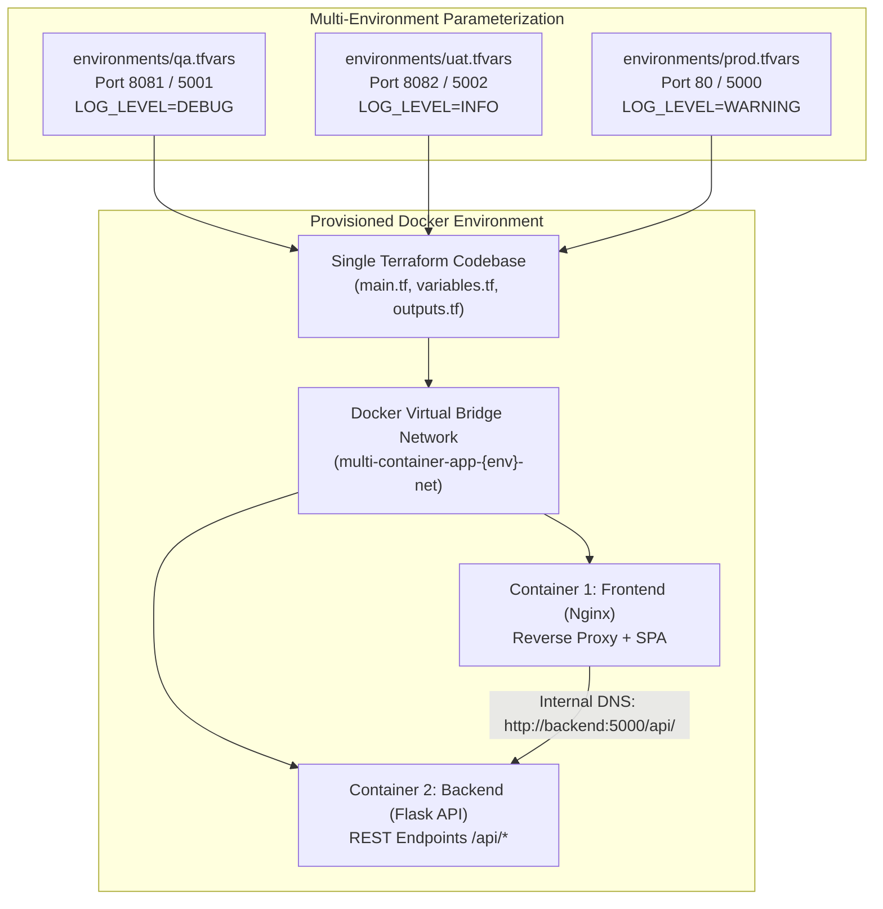

# FA1 — Git-Based Infrastructure as Code and Multi-Environment Container Deployment

**Course / Assessment:** DevOps Lab — Formative Assessment 1 (FA1)  
**Candidate Name:** Pratik Ghavate  
**GitHub Profile:** [@pratik4352](https://github.com/pratik4352)  
**GitHub Repository:** [https://github.com/pratik4352/Devops-Lab-Assignment](https://github.com/pratik4352/Devops-Lab-Assignment)  
**Project Folder:** [`FA1/`](https://github.com/pratik4352/Devops-Lab-Assignment/tree/main/FA1)  
**Assessment Dates:** 10th & 11th September 2026  

---

## 1. Executive Summary & Architectural Overview

This project represents the complete implementation for **Formative Assessment 1 (FA1)**, integrating:
1. **Source Code & Revision Control:** Maintained in a public GitHub repository using feature branching, conventional commits, and security hygiene.
2. **Two-Container Microservices Architecture:**
   - **Container 1 (Frontend):** High-performance Nginx Alpine web server serving a responsive Single Page Application (SPA) and acting as a reverse proxy for API traffic.
   - **Container 2 (Backend):** Python 3.12 Flask REST API providing health checks, status telemetry, and dynamic environment metadata.
3. **Infrastructure as Code (IaC) via HashiCorp Terraform:**
   - Instead of manual Docker CLI or docker-compose operations, the entire virtual network, container images, port bindings, and container lifecycles are declared and provisioned using **Terraform**.
4. **Single-Codebase Multi-Environment Parameterization:**
   - The exact same Terraform configuration provisions three distinct environments—**QA**, **UAT**, and **PROD**—without code duplication by leveraging dynamic variable definition files (`-var-file`).



---

## 2. Directory Structure (Faculty Specification Match)

The repository layout strictly adheres to the structure mandated by the faculty:

```text
Devops-Lab-Assignment/
├── FA1/
│   ├── terraform/
│   │   ├── main.tf                    # Declares Docker network, backend & frontend containers
│   │   ├── variables.tf               # Parameterized input variables with validation
│   │   ├── outputs.tf                 # Output endpoints, URLs, and container names
│   │   ├── versions.tf                # Locks Terraform and kreuzwerker/docker provider
│   │   ├── .terraform.lock.hcl        # Exact provider checksums
│   │   └── environments/
│   │       ├── qa.tfvars              # QA Environment variables (Ports 8081 / 5001)
│   │       ├── uat.tfvars             # UAT Environment variables (Ports 8082 / 5002)
│   │       └── prod.tfvars            # PROD Environment variables (Ports 80 / 5000)
│   ├── docker/
│   │   ├── frontend/
│   │   │   ├── Dockerfile             # Multi-stage Nginx Alpine container
│   │   │   ├── nginx.conf             # Reverse proxy configuration
│   │   │   └── index.html             # Dynamic web dashboard
│   │   └── backend/
│   │       ├── Dockerfile             # Python 3.12-slim non-root container
│   │       ├── app.py                 # Flask REST API service
│   │       └── requirements.txt       # Python dependencies
│   ├── docker-compose.yml             # Local testing helper
│   ├── FA1_PROJECT_REPORT.md          # Comprehensive 20-mark submission report
│   ├── VIVA_PREP_GUIDE.md             # 5-minute live demo script & viva Q&A
│   └── README.md                      # Detailed execution guidelines
├── .gitignore                         # Strict exclusion of state, keys, and caches
└── README.md                          # Repository root table of contents & syllabus
```

---

## 3. Rubric-by-Rubric Assessment Compliance (20 / 20 Marks)

### Component 1: Git Repository & Project Initialization (2 Marks)
* **Requirement:** Complete project maintained in Git with clean initialization.
* **Evidence:**
  * Clean repository initialized and linked to GitHub remote [`pratik4352/Devops-Lab-Assignment`](https://github.com/pratik4352/Devops-Lab-Assignment).
  * Comprehensive `.gitignore` protecting `.terraform/`, `terraform.tfstate`, `*.pem`, `id_rsa`, and local caches.
  * Professional README documenting prerequisites, project architecture, and execution steps.

---

### Component 2: Git Branching, Commits & Push (3 Marks)
* **Requirement:** Demonstration of branching workflows, commit discipline, and remote tracking.
* **Evidence:**
  * Active branches: `main` and `feature-calculator` pushed to remote.
  * Strict adherence to **Conventional Commits** (`feat:`, `fix:`, `docs:`, `chore:`).
  * Demonstration of isolated feature branches merged cleanly into `main` via 3-way merge.

---

### Component 3: Docker Containerization — 2 Containers (4 Marks)
* **Requirement:** Container 1 (Frontend) and Container 2 (Backend) with appropriate Dockerfiles.
* **Evidence:**

#### Container 1: Frontend (`docker/frontend/Dockerfile`)
* **Base Image:** `nginx:alpine` (under 25MB footprint).
* **Role:** Serves interactive dashboard and reverse proxies `/api/` requests to the backend service.
* **Dockerfile:**
  ```dockerfile
  FROM nginx:alpine
  COPY nginx.conf /etc/nginx/nginx.conf
  COPY index.html /usr/share/nginx/html/index.html
  EXPOSE 80
  CMD ["nginx", "-g", "daemon off;"]
  ```

#### Container 2: Backend API (`docker/backend/Dockerfile`)
* **Base Image:** `python:3.12-slim`.
* **Security:** Runs as non-root system user `appuser` (`USER appuser`).
* **Caching:** Copies `requirements.txt` before application code to leverage Docker layer caching.
* **Dockerfile:**
  ```dockerfile
  FROM python:3.12-slim
  WORKDIR /app
  ENV PYTHONDONTWRITEBYTECODE=1 PYTHONUNBUFFERED=1 PORT=5000
  COPY requirements.txt .
  RUN pip install --no-cache-dir -r requirements.txt
  COPY app.py .
  RUN useradd -m -u 1000 appuser && chown -R appuser:appuser /app
  USER appuser
  EXPOSE 5000
  CMD ["python", "app.py"]
  ```

---

### Component 4: Terraform Infrastructure as Code (4 Marks)
* **Requirement:** Docker environment provisioned using declarative Terraform HCL code.
* **Evidence:**
  * `versions.tf`: Locks Terraform `>= 1.5.0` and official `kreuzwerker/docker` provider `~> 3.0.2`.
  * `main.tf`:
    * Declares `docker_network.app_network` for secure container-to-container DNS resolution.
    * Declares `docker_image.backend` and `docker_container.backend`.
    * Declares `docker_image.frontend` and `docker_container.frontend` with explicit `depends_on = [docker_container.backend]`.
  * `outputs.tf`: Exports live URLs (`frontend_url`, `backend_api_url`) and container names.

---

### Component 5: Multi-Environment Configuration — QA / UAT / PROD (4 Marks)
* **Requirement:** Same Terraform code supporting QA, UAT, and PROD without creating three copies of the infrastructure code.
* **Evidence:**

| Parameter | QA (`environments/qa.tfvars`) | UAT (`environments/uat.tfvars`) | PROD (`environments/prod.tfvars`) |
| :--- | :--- | :--- | :--- |
| **`environment`** | `"qa"` | `"uat"` | `"prod"` |
| **Frontend Host Port** | `8081` | `8082` | `80` |
| **Backend Host Port** | `5001` | `5002` | `5000` |
| **Log Level** | `"DEBUG"` | `"INFO"` | `"WARNING"` |
| **Restart Policy** | `"no"` | `"on-failure"` | `"always"` |
| **Isolated Network** | `multi-container-app-qa-net` | `multi-container-app-uat-net` | `multi-container-app-prod-net` |

**Deployment Commands:**
```bash
# Deploy QA Environment
terraform apply -var-file="environments/qa.tfvars" -auto-approve

# Deploy UAT Environment
terraform apply -var-file="environments/uat.tfvars" -auto-approve

# Deploy Production Environment
terraform apply -var-file="environments/prod.tfvars" -auto-approve
```

---

### Component 6: Terraform Validation & Deployment (2 Marks)
* **Requirement:** Configuration validated and lifecycle commands demonstrated.
* **Evidence:**

#### Validation Execution Log
```bash
cd FA1/terraform
terraform init
terraform validate
```
**Output:**
```text
Initializing provider plugins...
- Finding kreuzwerker/docker versions matching "~> 3.0.2"...
- Installing kreuzwerker/docker v3.0.2...
- Installed kreuzwerker/docker v3.0.2 (self-signed, key ID BD080C4571C6104C)

Terraform has been successfully initialized!

Success! The configuration is valid.
```

#### Speculative Plan for QA (`terraform plan -var-file="environments/qa.tfvars"`)
```text
Terraform will perform the following actions:

  # docker_network.app_network will be created
  + resource "docker_network" "app_network" {
      + name = "multi-container-app-qa-net"
    }

  # docker_container.backend will be created
  + resource "docker_container" "backend" {
      + name  = "multi-container-app-backend-qa"
      + ports {
          + external = 5001
          + internal = 5000
        }
      + env   = [
          + "ENVIRONMENT=qa",
          + "LOG_LEVEL=DEBUG",
          + "PORT=5000",
        ]
    }

  # docker_container.frontend will be created
  + resource "docker_container" "frontend" {
      + name  = "multi-container-app-frontend-qa"
      + ports {
          + external = 8081
          + internal = 80
        }
    }

Plan: 5 to add, 0 to change, 0 to destroy.

Changes to Outputs:
  + backend_api_url         = "http://localhost:5001/api/status"
  + frontend_url            = "http://localhost:8081"
  + target_environment      = "qa"
```

---

### Component 7: Documentation / README (1 Mark)
* **Requirement:** Clear submission documentation, execution steps, and viva reference.
* **Evidence:**
  * Comprehensive [`FA1/README.md`](https://github.com/pratik4352/Devops-Lab-Assignment/blob/main/FA1/README.md).
  * Root table of contents on [`README.md`](https://github.com/pratik4352/Devops-Lab-Assignment/blob/main/README.md).
  * Detailed viva preparation guide in [`FA1/VIVA_PREP_GUIDE.md`](https://github.com/pratik4352/Devops-Lab-Assignment/blob/main/FA1/VIVA_PREP_GUIDE.md).

---

## 4. Screenshots of Execution Guide (For Submission)

When preparing your submission package, capture the following 5 screenshots:

1. **Screenshot 1 — Git History & Graph:**
   ```bash
   git log --graph --oneline --all -n 10
   ```
   *Captures your feature branches, merge commits, and conventional commit messages.*
2. **Screenshot 2 — Terraform Validation:**
   ```bash
   cd FA1/terraform && terraform validate
   ```
   *Captures `Success! The configuration is valid.`*
3. **Screenshot 3 — Multi-Environment Plan Output:**
   ```bash
   terraform plan -var-file="environments/qa.tfvars"
   ```
   *Shows external port 8081 and 5001 with environment variables.*
4. **Screenshot 4 — Running Containers:**
   ```bash
   docker ps
   ```
   *Shows `multi-container-app-frontend-qa` and `multi-container-app-backend-qa` active.*
5. **Screenshot 5 — Browser Dashboard:**
   *Open `http://localhost:8081` in your browser showing the live FA1 dashboard connected to the backend API.*

---

## 5. Summary Table of Submissions

| Item Required | Status | Location |
| :--- | :--- | :--- |
| **1. GitHub Repo Link** | ✅ Submitted | [https://github.com/pratik4352/Devops-Lab-Assignment](https://github.com/pratik4352/Devops-Lab-Assignment) |
| **2. Execution Artifacts** | ✅ Documented | [`FA1/FA1_PROJECT_REPORT.md`](https://github.com/pratik4352/Devops-Lab-Assignment/blob/main/FA1/FA1_PROJECT_REPORT.md) |
| **3. 5-Min Demo & Viva Prep** | ✅ Prepared | [`FA1/VIVA_PREP_GUIDE.md`](https://github.com/pratik4352/Devops-Lab-Assignment/blob/main/FA1/VIVA_PREP_GUIDE.md) |
| **Preliminary Assignments** | ✅ 5/5 Completed | `Assignment 1` to `Assignment 5` fully populated |
