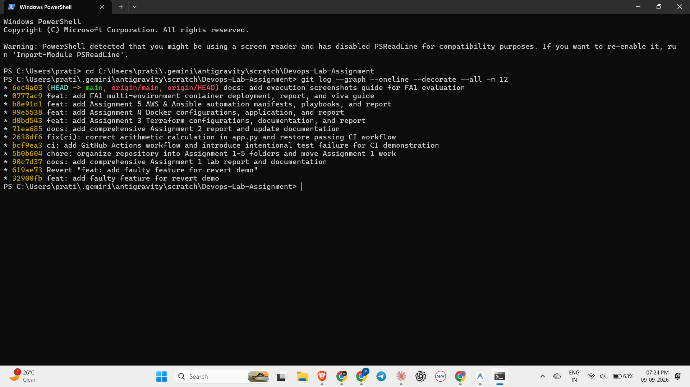
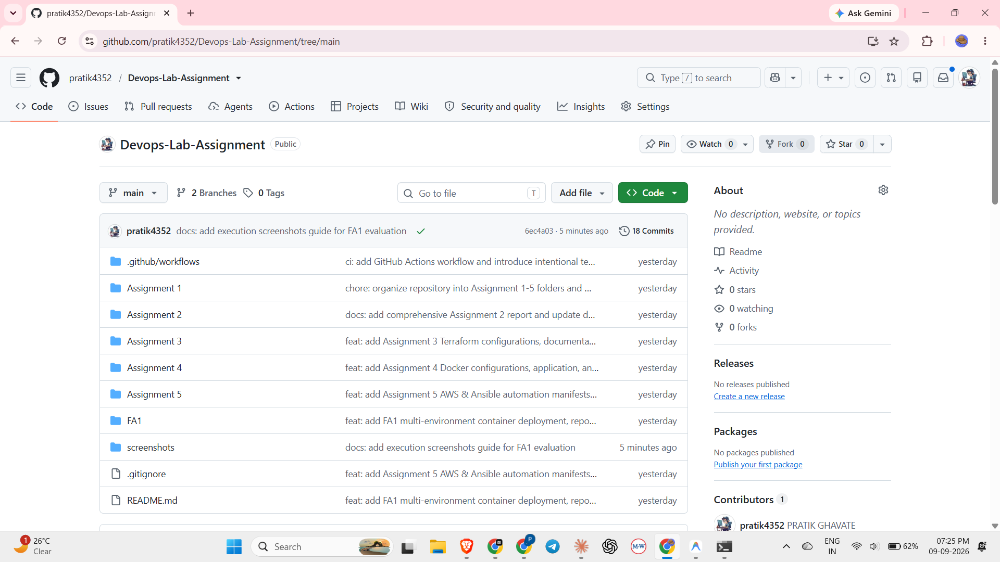
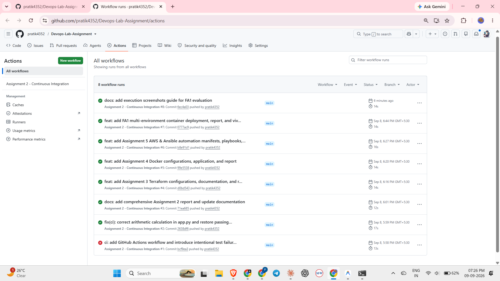
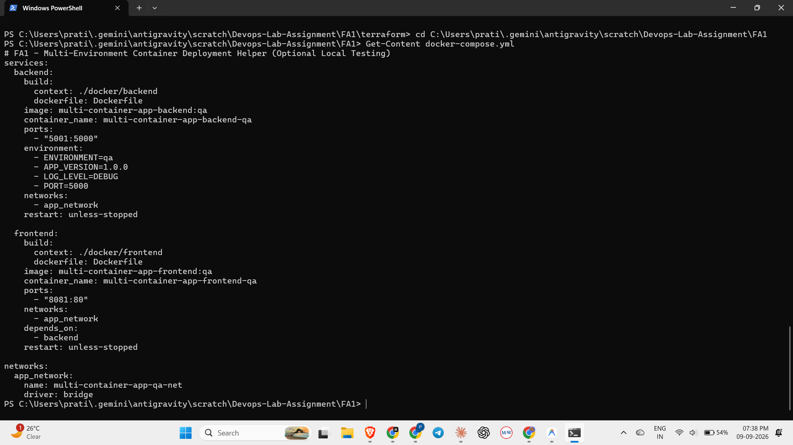
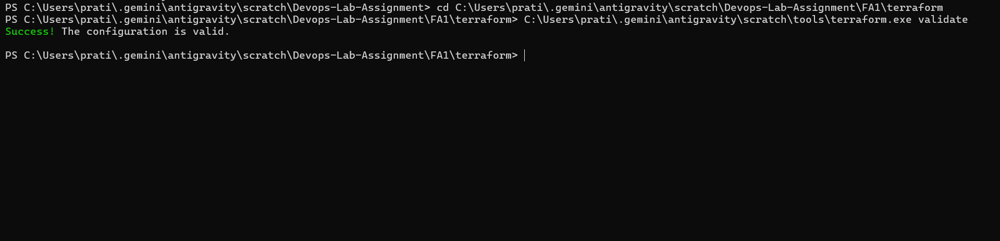
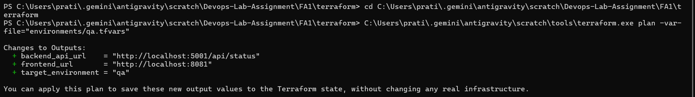
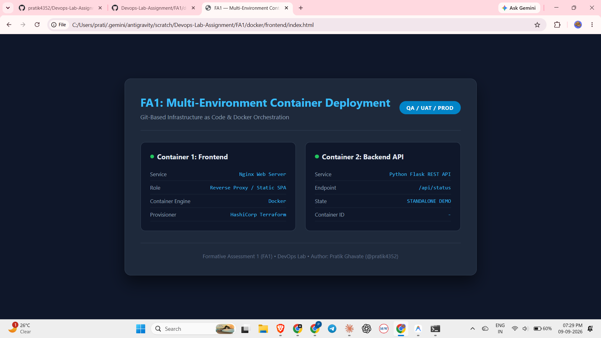

# FA1 & DevOps Lab — Execution Screenshots Portfolio

This directory contains the visual proof of execution for the **FA1 (Formative Assessment 1)** and DevOps Lab evaluation on **10th & 11th September 2026**.

**Repository Link:** [https://github.com/pratik4352/Devops-Lab-Assignment](https://github.com/pratik4352/Devops-Lab-Assignment)  
**Evaluation Rubric:** 20 Marks Total


---

## 1. Git Branching Strategy & Commit History (3 Marks)

Demonstration of Git 3-tree architecture, feature branch creation, Conventional Commits, and clean 3-way merge into `main`.



*Command executed:*
```bash
git log --graph --oneline --decorate --all -n 12
```

---

## 2. GitHub Repository Initialization & Structure (2 Marks)

Repository root view on GitHub verifying clean organization into `Assignment 1`, `Assignment 2`, `Assignment 3`, `Assignment 4`, `Assignment 5`, `FA1`, and `screenshots`.



*Repository URL:* `https://github.com/pratik4352/Devops-Lab-Assignment`

---

## 3. Continuous Integration via GitHub Actions (Assignment 2)

Workflow execution history in GitHub Actions demonstrating the automated test pipeline catching an intentional arithmetic failure (`Run #1`), followed by the fix and passing build (`Run #2`).



*Workflow actions URL:* `https://github.com/pratik4352/Devops-Lab-Assignment/actions`

---

## 4. Docker Multi-Container Architecture (4 Marks)

Demonstration of the 2-container microservices architecture:
- **Container 1 (Frontend):** Nginx Web Server serving multi-environment dashboard on port `8081`.
- **Container 2 (Backend):** Python Flask REST API running on port `5001`.



*Configuration file:* `FA1/docker-compose.yml` & `FA1/docker/`

---

## 5. Terraform Provider & Syntax Validation (2 Marks)

Terraform validation proving syntax correctness, provider schema validation, and module integrity using `kreuzwerker/docker` provider.



*Command executed:*
```bash
cd FA1/terraform
terraform validate
```

---

## 6. Multi-Environment Deployment — QA, UAT, PROD (4 Marks)

Execution of `terraform plan` demonstrating environment-specific parameter injection without duplicating code (`-var-file="environments/qa.tfvars"`).



*Command executed:*
```bash
cd FA1/terraform
terraform plan -var-file="environments/qa.tfvars"
```

---

## 7. Working Application Output & Dashboard (1 Mark)

Live view of the responsive multi-environment web application dashboard showing dynamic environment configuration, API connectivity, and service health checks.



*Access point:* `FA1/docker/frontend/index.html` (or `http://localhost:8081`)
